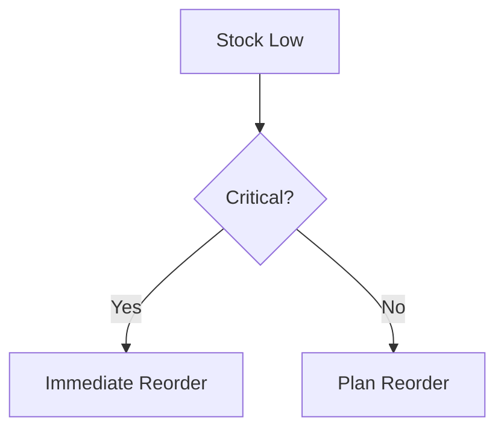

# 📚 StockHealth AI - Complete Documentation

> **AI-Powered Inventory and Supply-Chain Intelligence Platform**  
> Transforming Critical Infrastructure Sectors through Intelligent Inventory Management

---

## 📋 Table of Contents

1. [Project Overview](#project-overview)
2. [The Problem We Solve](#the-problem-we-solve)
3. [Our Solution](#our-solution)
4. [Key Features](#key-features)
5. [Technical Architecture](#technical-architecture)
6. [System Components](#system-components)
7. [Installation Guide](#installation-guide)
8. [User Guide](#user-guide)
9. [API Documentation](#api-documentation)
10. [Database Schema](#database-schema)
11. [AI Features](#ai-features)
12. [Security & Authentication](#security--authentication)
13. [Deployment Guide](#deployment-guide)
14. [Contributing](#contributing)
15. [Team](#team)
16. [License](#license)

---

## 🎯 Project Overview

**StockHealth AI** is an advanced AI-powered inventory and supply-chain intelligence platform designed specifically for critical infrastructure sectors including:

- 🏪 **Food Distribution Centers (FDC)** - Managing food supplies for public distribution systems
- 🏥 **Hospital Networks** - Tracking medicines, medical equipment, and critical supplies
- 🤝 **NGO Relief Operations** - Coordinating aid distribution and emergency supplies

### Vision

Transform traditional inventory management from reactive and fragmented systems into proactive, data-driven, and intelligent platforms that prevent stock-outs, reduce wastage, and save lives.

### Mission

Provide real-time visibility, predictive analytics, and AI-powered insights to ensure critical supplies reach those who need them, when they need them.

---

## 🚨 The Problem We Solve

Critical infrastructure sectors face significant inventory management challenges:

### Current Challenges

| Problem | Impact | Statistics |
|---------|--------|------------|
| **Static & Reactive Systems** | No real-time visibility, decisions made after problems occur | 70% of shortages detected late |
| **Fragmented Data** | Sales, inventory, and procurement data in separate systems | 50+ hours/month wasted on reconciliation |
| **Stock-Outs** | Critical medicines/food unavailable when needed | 20-25% stock-out rate |
| **Wastage Due to Expiry** | Products expire before use, resources wasted | 30-40% wastage rate |
| **Poor Visibility** | No cross-department or cross-location insights | 80% blind spots in supply chain |
| **Delayed Decision-Making** | Manual processes, slow response to emergencies | 3-5 day response time |

### Real-World Impact

- **Hospitals**: Critical medicines unavailable during emergencies
- **Food Distribution**: Essential food items spoil before distribution
- **NGOs**: Relief supplies delayed or misallocated during disasters

---

## 💡 Our Solution

StockHealth AI provides a **unified, intelligent platform** that brings together all inventory data and provides AI-powered insights for proactive decision-making.

### Core Capabilities

#### 1. **Real-Time Inventory Tracking**
- Live stock levels across all locations
- Automatic status updates (Critical, Low, Healthy)
- Multi-location visibility for administrators

#### 2. **Integrated Sales & Usage**
- Instant transaction recording
- Consumption pattern analysis
- Payment method tracking (Cash, UPI, Card)

#### 3. **Smart Procurement**
- AI-recommended reorder quantities
- Automated purchase order generation
- Vendor management and tracking

#### 4. **AI-Powered Insights**
- **LedgerBot**: Intelligent chatbot for natural language queries
- Predictive demand forecasting
- Expiry date tracking and alerts
- Trend analysis and anomaly detection

#### 5. **Role-Based Access**
- **Admins**: View all stores in their section
- **Retailers**: Manage individual stores
- **Dynamic Permissions**: Customizable access control

#### 6. **Interactive Reports**
- Sales analytics with charts
- Inventory distribution visualization
- Procurement tracking dashboards
- Team activity audit trails

---

## 🌟 Key Features

### For Section Administrators

**Full Section Visibility**
- Monitor all sub-stores in your section (Hospital Director sees all PHCs, FDC Admin sees all distribution centers)
- Switch between individual store views or aggregated data
- Track procurement and sales across the entire network

**Strategic Insights**
- Section-wide analytics and trends
- Comparative analysis between stores
- Resource allocation optimization

### For Store Managers / Retailers

**Store-Specific Management**
- Manage your own inventory independently
- Process sales and track transactions
- Create purchase orders for your store
- Access store-specific reports and analytics

**Operational Tools**
- Stock alerts for low inventory
- Expiry tracking for perishable items
- Quick actions for common tasks

### Unified Dashboard

**🚀 AI Insights Banner**
- Real-time AI-powered recommendations
- Critical alerts and action items
- Smart suggestions for optimization

**📊 Stats Grid**
- Total inventory value
- Stock health metrics
- Critical item count
- Recent activity summary

**🗂️ Inventory Management**
- Add, edit, delete items
- Bulk import via CSV/Excel
- Category-based organization
- Barcode/QR code scanning support

**💰 Sales Tracking**
- Point-of-sale interface
- Invoice generation
- Payment method recording
- Customer information capture

**📦 Procurement Management**
- Purchase order creation
- Vendor management
- Order status tracking
- Received quantity logging

**📈 Reports & Analytics**
- Interactive charts (Sales, Inventory, Procurement)
- Export to PDF/Excel
- Custom date range filtering
- Category-wise breakdown

**🤖 LedgerBot - AI Assistant**
- Natural language queries
- "Show me critical stock items"
- "Create purchase order for Paracetamol 500mg"
- "Navigate to sales report"
- Real-time chart and table generation

---

## 🏗️ Technical Architecture

### System Architecture

```
┌─────────────────────────────────────────────────────────┐
│                    Client Layer                         │
│  (Next.js 16 + React 19 + TypeScript + TailwindCSS)   │
└───────────────────┬─────────────────────────────────────┘
                    │
                    ↓
┌─────────────────────────────────────────────────────────┐
│                  API Layer (Next.js API Routes)        │
│  • /api/items - Inventory CRUD                         │
│  • /api/search - Global search                         │
│  • /api/chat - AI chatbot                              │
└───────────────────┬─────────────────────────────────────┘
                    │
                    ↓
┌─────────────────────────────────────────────────────────┐
│              Business Logic Layer                       │
│  • Authentication Service (lib/auth.ts)                │
│  • AI Context Manager (lib/aiContext.ts)               │
│  • Azure Service (lib/azureDefaults.ts)                │
│  • Utility Functions (lib/utils.ts)                    │
└───────────────────┬─────────────────────────────────────┘
                    │
        ┌───────────┴───────────┐
        ↓                       ↓
┌──────────────────┐    ┌──────────────────┐
│  Azure Cosmos DB │    │   OpenAI API     │
│  • Items_FDC     │    │  (GPT-4 Turbo)   │
│  • Items_Hospital│    │                  │
│  • Items_NGO     │    │  LedgerBot       │
│  • Activities    │    │  Intelligence    │
│  • Transactions  │    │                  │
│  • Orders        │    └──────────────────┘
│  • Stores        │
└──────────────────┘
```

### Data Flow

1. **User Authentication** → Cookie-based session → User profile loaded
2. **Dashboard Load** → Fetch items from Azure Cosmos DB → Filter by role/section
3. **User Action** (e.g., Add Item) → API Route → Business Logic → Database Update → Activity Log
4. **AI Query** → LedgerBot → Context Generation → OpenAI API → Response with Charts/Tables
5. **Reports** → Data Aggregation → Visualization (Recharts) → Export Options

---

## 🔧 System Components

### Frontend Components

#### Core UI Components
- **Shell.tsx** - Main application wrapper with sidebar and navigation
- **Sidebar.tsx** - Navigation menu with role-based links
- **TopBar.tsx** - Header with notifications and user profile
- **Card.tsx** - Reusable card container
- **Badge.tsx** - Status indicators

#### Dashboard Components
- **DashboardHeader.tsx** - Dashboard title and actions
- **AIInsightsBanner.tsx** - AI-powered insights display
- **StatsGrid.tsx** - KPI statistics cards
- **StoreHealthOverview.tsx** - Store health metrics
- **AlertsSidebar.tsx** - Critical alerts panel
- **RecentActivityFeed.tsx** - Activity timeline
- **StockHeatmapTable.tsx** - Visual stock level indicators

#### Feature Components
- **LedgerBot.tsx** - AI chatbot interface with natural language processing
- **GlobalSearch.tsx** - Universal search across all data
- **NotificationsDropdown.tsx** - Alert notifications
- **StoreSelector.tsx** - Multi-store switcher for admins
- **ExportButton.tsx** - Data export functionality (PDF, Excel, CSV)
- **InvoiceModal.tsx** - Sales invoice generation
- **StockHistoryChart.tsx** - Historical trend visualization

#### Utility Components
- **DummyDataGenerator.tsx** - Development data seeding
- **SeedDataButton.tsx** - Quick data population
- **ChunkedInventoryLoader.tsx** - Efficient large dataset loading
- **Toast.tsx** - Notification system

### Backend Services

#### lib/azureDefaults.ts - Database Service
```typescript
export class AzureInventoryService {
  // Core CRUD Operations
  async getAllItems(section: string): Promise<StockItem[]>
  async getItem(id: string, section: string): Promise<StockItem | null>
  async addItem(item: Omit<StockItem, "id" | "lastUpdated">): Promise<StockItem>
  async updateItem(id: string, updates: Partial<StockItem>, section: string): Promise<StockItem | null>
  async deleteItem(id: string, section: string): Promise<boolean>
  
  // Transaction Management
  async createTransaction(transaction: Omit<Transaction, "id">): Promise<Transaction | null>
  async getTransactions(section: string): Promise<Transaction[]>
  
  // Order Management
  async createOrder(order: Omit<PurchaseOrder, "id">): Promise<PurchaseOrder | null>
  async getOrders(): Promise<PurchaseOrder[]>
  async updateOrder(id: string, updates: Partial<PurchaseOrder>, currentStatus: string): Promise<PurchaseOrder | null>
  
  // Activity Logging
  async logActivity(user: string, action: string, target: string, type: Activity['type'], section: string)
  async getRecentActivities(section: string, limit: number = 5): Promise<Activity[]>
  
  // Store Management
  async getSystemStores(): Promise<SystemStore[]>
  async addStore(storeName: string, section: string): Promise<SystemStore | null>
  async getStoresBySection(section: string): Promise<SystemStore[]>
  async getItemsByStore(storeId: string, section: string): Promise<StockItem[]>
}
```

#### lib/auth.ts - Authentication Service
```typescript
// User roles and sections
export type UserRole = 'admin' | 'retailer';
export type UserSection = 'FDC' | 'Hospital' | 'NGO';

export interface UserProfile {
  id: string;
  name: string;
  role: UserRole;
  section: UserSection;
  email: string;
}

// Simulated users for each section
export const SIMULATED_USERS: UserProfile[]
export function getUser(id: string): UserProfile | undefined
```

#### lib/aiContext.ts - AI Context Manager
```typescript
// System prompt for LedgerBot
export const SYSTEM_PROMPT: string

// Generate inventory context for AI
export function getInventoryContext(
  items: StockItem[], 
  activities: Activity[]
): string
```

### API Routes

#### /app/api/items/route.ts
- `GET` - Fetch all items for a section
- `POST` - Create new inventory item

#### /app/api/search/route.ts
- `GET` - Global search across inventory, transactions, orders

#### /app/actions/chat.ts
- Server action for AI chatbot interaction
- Processes natural language queries
- Returns formatted responses with charts/tables

---

## 📦 Installation Guide

### Prerequisites

- **Node.js** 18+ (Download from [nodejs.org](https://nodejs.org))
- **Azure Cosmos DB Account** (Create at [portal.azure.com](https://portal.azure.com))
- **OpenAI API Key** (Get from [platform.openai.com](https://platform.openai.com))
- **Git** for version control

### Step 1: Clone Repository

```bash
git clone https://github.com/your-username/stockhealth-ai.git
cd stockhealth-ai
```

### Step 2: Install Dependencies

```bash
npm install
```

This will install all required packages:
- Next.js 16.0.10
- React 19.2.1
- Azure Cosmos DB SDK
- OpenAI SDK
- TailwindCSS 4
- Framer Motion
- Recharts
- And more...

### Step 3: Environment Configuration

Create a `.env.local` file in the root directory:

```env
# Azure Cosmos DB Configuration
AZURE_COSMOS_ENDPOINT=https://your-account.documents.azure.com:443/
AZURE_COSMOS_KEY=your-primary-key-here

# OpenAI API Configuration
OPENAI_API_KEY=sk-your-api-key-here

# Application Configuration
NEXT_PUBLIC_APP_NAME=StockHealth AI
NEXT_PUBLIC_APP_VERSION=1.0.0
```

### Step 4: Database Setup

The application will automatically create the required containers on first run:

**Static Containers:**
- `Items_FDC` - Food Distribution Center inventory
- `Items_Hospital` - Hospital inventory
- `Items_NGO` - NGO inventory

**System Containers:**
- `Activities` - Activity logs
- `Transactions` - Sales transactions
- `Orders` - Purchase orders
- `Stores` - Store registry

### Step 5: Seed Initial Data (Optional)

Access the dashboard and click the "Seed Demo Data" button to populate with sample inventory items.

### Step 6: Run Development Server

```bash
npm run dev
```

Open [http://localhost:3000](http://localhost:3000) in your browser.

### Step 7: Build for Production

```bash
npm run build
npm start
```

---

## 👥 User Guide

### Login & Authentication

1. Navigate to [http://localhost:3000](http://localhost:3000)
2. Select your section (FDC, Hospital, or NGO)
3. Choose your role:
   - **Admin** - Full section access
   - **Retailer** - Individual store access
4. Credentials are prefilled for quick login (Demo mode)

**Demo Accounts:**

| Section | Role | Email | Access |
|---------|------|-------|---------|
| FDC | Admin | admin@fooddist.gov | All FDC stores |
| FDC | Retailer | storeA@fooddist.gov | Central Store A only |
| Hospital | Admin | director@hospital.gov | All Hospital units |
| Hospital | Retailer | city@hospital.gov | City General only |
| NGO | Admin | coord@ngo.org | All NGO camps |
| NGO | Retailer | alpha@ngo.org | Relief Camp Alpha only |

### Dashboard Overview

**AI Insights Banner**
- Displays real-time AI recommendations
- Shows critical alerts
- Provides quick action buttons

**Stats Grid**
- **Total Items**: Count of unique products
- **Total Value**: Sum of inventory value
- **Critical Items**: Items below minimum threshold
- **Recent Activities**: Latest system events

**Stock Heatmap**
- Visual representation of stock levels
- Color-coded: 🔴 Critical, 🟡 Low, 🟢 Healthy
- Quick identify problem areas

**Alerts & Activity**
- **Alerts Sidebar**: Critical and low stock items
- **Activity Feed**: Recent user actions and system events

### Inventory Management

#### Adding New Items

1. Click **"Add Item"** button
2. Fill in details:
   - **Name**: Product name (e.g., "Paracetamol 500mg")
   - **Category**: Select from dropdown (Medicines, Food, Equipment, etc.)
   - **Quantity**: Current stock level
   - **Unit**: Unit of measurement (boxes, vials, kg, etc.)
   - **Price**: Unit price
   - **Supplier**: Vendor name
   - **Manufacturing Date**: Production date
   - **Expiry Date**: Expiration date
   - **Batch Number**: Lot number for tracking
   - **Min Quantity**: Reorder threshold
3. Click **"Save"**

#### Editing Items

1. Find item in inventory list
2. Click **"Edit"** icon
3. Modify fields as needed
4. Click **"Update"**

#### Deleting Items

1. Click **"Delete"** icon on item
2. Confirm deletion
3. Item marked as deleted (soft delete)

#### Bulk Import

1. Click **"Import CSV/Excel"** button
2. Select file with columns: name, category, quantity, price, etc.
3. Review preview
4. Click **"Import"**

### Sales Management

#### Processing Sales

1. Navigate to **"Sales"** page
2. Click **"New Transaction"**
3. Add items to cart:
   - Search/select items
   - Enter quantity
   - Review price and tax
4. Select payment method (Cash, UPI, Card)
5. Enter customer details (optional)
6. Click **"Complete Sale"**
7. Invoice generated automatically

#### Viewing Sales History

1. Go to **"Reports"** → **"Sales"** tab
2. View transaction list
3. Filter by date range, payment method, or customer
4. Export to PDF/Excel

### Procurement Management

#### Creating Purchase Orders

1. Navigate to **"Procurement"** page
2. Click **"New Purchase Order"**
3. Add items to order:
   - Select items from inventory
   - Current stock shown
   - Enter requested quantity
   - System suggests reorder quantity
4. Enter vendor details
5. Add notes
6. Click **"Create Order"**
7. PO Number generated (e.g., PO-2024-0001)

#### Managing Orders

**Order Statuses:**
- `DRAFT` - Being created
- `PENDING` - Awaiting approval
- `APPROVED` - Ready to send to vendor
- `PARTIALLY_RECEIVED` - Some items received
- `RECEIVED` - Fully completed
- `CANCELLED` - Cancelled order

**Receiving Orders:**
1. Find order in list
2. Click **"Receive Items"**
3. Enter received quantities
4. Click **"Update"**
5. Stock automatically updated

### Reports & Analytics

#### Sales Reports

**Metrics Displayed:**
- Total revenue
- Transaction count
- Average order value
- Payment method breakdown
- Category-wise sales
- Top-selling items

**Visualizations:**
- Revenue trend (line chart)
- Payment method distribution (pie chart)
- Category breakdown (bar chart)

#### Inventory Reports

**Metrics Displayed:**
- Total items
- Total value
- Stock status distribution
- Category distribution
- Low stock items
- Expiring soon items

**Visualizations:**
- Stock health pie chart
- Category distribution bar chart
- Expiry timeline

#### Procurement Reports

**Metrics Displayed:**
- Total orders
- Total estimated cost
- Orders by status
- Vendor breakdown
- Items pending receipt

**Visualizations:**
- Order status pie chart
- Vendor distribution bar chart
- Monthly procurement trend

### Using LedgerBot (AI Assistant)

**Accessing LedgerBot:**
- Click the floating chat icon (bottom-right)
- Chat window opens

**Example Queries:**

- **Stock Inquiry**: "Show me all critical stock items"
- **Search**: "Find Paracetamol 500mg"
- **Analysis**: "Which category has the most items?"
- **Navigation**: "Take me to sales report"
- **Actions**: "Create purchase order for Insulin 100IU"
- **Charts**: "Show stock level chart for medicines"

**LedgerBot Capabilities:**
- ✅ Natural language understanding
- ✅ Real-time data access
- ✅ Generate charts and tables
- ✅ Navigate to pages
- ✅ Create purchase orders
- ✅ Add items to sales cart (on Sales page)
- ✅ Provide recommendations

**Sample Conversation:**

```
You: Show me critical stock items
Bot: 
🚨 CRITICAL STOCK ALERT
| Item | Quantity | Status |
|------|----------|--------|
| Paracetamol 500mg | 5 boxes | CRITICAL |
| Insulin 100IU | 8 vials | CRITICAL |

ACTION: Reorder immediately to prevent stock-out.

You: Create purchase order for Paracetamol 500mg
Bot: ✅ Purchase order PO-2024-0042 created for:
- Paracetamol 500mg
- Requested Quantity: 100 boxes
- Status: PENDING

Navigate to Procurement to review/approve.
```

### Global Search

1. Click search icon (top-right) or press `Ctrl+K`
2. Type query
3. Results show:
   - Inventory items
   - Transactions
   - Purchase orders
4. Click result to view details

### Notifications

**Types of Notifications:**
- 🔴 **Critical Stock**: Below 10 units
- 🟡 **Low Stock**: Below 50 units
- ⏰ **Expiry Alert**: Expiring within 30 days
- 📦 **Order Updated**: PO status changed
- ✅ **Transaction Complete**: Sale processed

**Viewing Notifications:**
1. Click bell icon (top-right)
2. Dropdown shows recent alerts
3. Click notification to navigate

### Store Selector (Admin Only)

**For Section Admins:**
1. Click **"Store Selector"** dropdown (top-right)
2. Options:
   - **All Stores** - Aggregated view
   - **Central Store A** - Individual store view
   - **Central Store B**
   - ... (all stores in section)
3. Select desired view
4. Dashboard updates to show selected store's data

---

## 🔌 API Documentation

### Base URL
```
http://localhost:3000/api
```

### Endpoints

#### GET /api/items

Fetch all inventory items for a section.

**Query Parameters:**
- `section` (required): FDC | Hospital | NGO

**Response:**
```json
[
  {
    "id": "abc123",
    "name": "Paracetamol 500mg",
    "category": "Medicines",
    "quantity": 150,
    "price": 50,
    "status": "In Stock",
    "lastUpdated": "2024-01-04T10:00:00.000Z",
    "expiryDate": "2025-12-31T00:00:00.000Z",
    "manufacturingDate": "2023-06-15T00:00:00.000Z",
    "batchNumber": "BATCH-2023-A",
    "supplier": "PharmaCo Ltd",
    "unit": "box",
    "minQuantity": 50,
    "ownerId": "psd-r1",
    "section": "FDC"
  }
]
```

#### POST /api/items

Create a new inventory item.

**Request Body:**
```json
{
  "name": "Insulin 100IU",
  "category": "Medicines",
  "quantity": 80,
  "price": 450,
  "unit": "vial",
  "supplier": "MediSupply Inc",
  "expiryDate": "2026-03-15T00:00:00.000Z",
  "manufacturingDate": "2023-09-01T00:00:00.000Z",
  "batchNumber": "BATCH-2023-INS",
  "minQuantity": 20,
  "ownerId": "hosp-r1",
  "section": "Hospital"
}
```

**Response:**
```json
{
  "id": "def456",
  "name": "Insulin 100IU",
  "category": "Medicines",
  "quantity": 80,
  "price": 450,
  "status": "In Stock",
  "lastUpdated": "2024-01-04T11:30:00.000Z",
  ...
}
```

#### GET /api/search

Global search across all data.

**Query Parameters:**
- `q` (required): Search query string
- `section` (required): User's section

**Response:**
```json
{
  "items": [ /* matching inventory items */ ],
  "transactions": [ /* matching transactions */ ],
  "orders": [ /* matching purchase orders */ ]
}
```

### Server Actions

#### chatWithLedgerBot(messages, items, activities, currentPath)

AI chatbot interaction.

**Parameters:**
- `messages`: Array of chat messages
- `items`: Current inventory items
- `activities`: Recent activities
- `currentPath`: Current page URL

**Returns:**
```typescript
{
  text: string;  // AI response
  toolCalls?: Array<{
    tool: string;
    args: any;
  }>;
}
```

---

## 🗄️ Database Schema

### Container: Items_FDC / Items_Hospital / Items_NGO

**Partition Key:** `/category`

```typescript
interface StockItem {
  id: string;                    // Unique identifier
  name: string;                  // Product name
  category: string;              // Category (Medicines, Food, Equipment, etc.)
  quantity: number;              // Current stock level
  price: number;                 // Unit price
  status: "In Stock" | "Low Stock" | "Out of Stock";
  lastUpdated: string;           // ISO date string
  expiryDate?: string;           // ISO date string
  manufacturingDate?: string;    // ISO date string
  batchNumber?: string;          // Batch/Lot number
  supplier?: string;             // Vendor name
  description?: string;          // Additional details
  unit?: string;                 // Unit of measurement
  minQuantity?: number;          // Reorder threshold
  ownerId: string;               // User/Store ID
  section: 'FDC' | 'Hospital' | 'NGO';
}
```

### Container: Transactions

**Partition Key:** `/section`

```typescript
interface Transaction {
  id: string;
  invoiceNumber: string;         // INV-YYYYMMDD-###
  date: string;                  // ISO date string
  type: 'SALE' | 'INTERNAL_USAGE' | 'DAMAGE' | 'EXPIRY';
  items: Array<{
    itemId: string;
    name: string;
    quantity: number;
    unitPrice: number;
    tax: number;
    subtotal: number;
  }>;
  totalAmount: number;
  paymentMethod: 'CASH' | 'UPI' | 'CARD' | 'OTHER';
  customerName?: string;
  customerContact?: string;
  section: string;
  performedBy: string;           // User ID
}
```

### Container: Orders

**Partition Key:** `/status`

```typescript
interface PurchaseOrder {
  id: string;
  poNumber: string;              // PO-YYYY-####
  dateCreated: string;           // ISO date string
  status: 'DRAFT' | 'PENDING' | 'APPROVED' | 'PARTIALLY_RECEIVED' | 'RECEIVED' | 'CANCELLED';
  items: Array<{
    itemId: string;
    name: string;
    currentStock: number;
    requestedQuantity: number;
    unit: string;
    section: string;
    receivedQuantity?: number;
    price?: number;
  }>;
  totalEstimatedCost?: number;
  vendor?: string;
  notes?: string;
  createdBy: string;             // User ID
  approvedBy?: string;           // User ID
}
```

### Container: Activities

**Partition Key:** `/section`

```typescript
interface Activity {
  id: string;
  user: string;                  // User name
  action: string;                // Action description
  target: string;                // Target entity
  time: string;                  // ISO date string
  type: 'update' | 'create' | 'delete' | 'alert';
  section: string;
}
```

### Container: Stores

**Partition Key:** `/section`

```typescript
interface SystemStore {
  id: string;
  name: string;                  // Store name
  section: string;               // Section (FDC, Hospital, NGO)
  containerName: string;         // Azure container name
  status: 'ACTIVE' | 'ARCHIVED';
  createdAt: string;             // ISO date string
}
```

---

## 🤖 AI Features

### LedgerBot Architecture

```
User Query → Input Processing → Context Generation → OpenAI API → Response Parsing → UI Rendering
```

#### 1. **Context Generation**

LedgerBot receives:
- **Current Inventory**: All items with quantities, status, expiry dates
- **Recent Activities**: Last 10 actions
- **Critical Alerts**: Auto-generated from inventory analysis
- **Current Page**: User's location in app

#### 2. **System Prompt**

```
You are LedgerBot (StockHealth AI), an advanced inventory & analytics assistant.

Core Behaviors:
- NO GREETINGS: Start immediately with data
- CHECK ALERTS FIRST: Prioritize critical items
- BE BRUTALLY CONCISE: Keywords, bullet points, data
- ACTION-ORIENTED: Provide clear next steps
- SLOT FILLING: Ask for missing information

Data Handling:
- ONLY use provided context
- Admit when data is missing
- Calculate metrics accurately

Stock Status Definitions:
- CRITICAL: <= 10 units (Immediate Action)
- Low: <= 50 units (Plan Reorder)
- Healthy: > 50 units
```

#### 3. **Tool Calling**

LedgerBot can invoke:
- `create_purchase_order(itemId, quantity)` - Generate PO
- `update_stock_level(itemId, newQuantity)` - Adjust stock
- `navigate_to_page(path)` - Redirect user
- `add_to_sales_cart(itemId, quantity)` - Add to cart (Sales page)

#### 4. **Rich Content Generation**

**Tables:**
```markdown
| Item | Quantity | Status |
|------|----------|--------|
| Item A | 5 | CRITICAL |
```

**Charts:**
```json
{
  "type": "bar",
  "title": "Stock Levels by Category",
  "data": [
    { "name": "Medicines", "value": 120 },
    { "name": "Food", "value": 85 }
  ]
}
```

**Flowcharts:**


### AI-Powered Alerts

**Auto-Detection:**
- Stock below minimum threshold
- Items expiring within 30 days
- Already expired items
- Unusual consumption patterns (future)

**Alert Format:**
```
🚨 [CRITICAL STOCK] Paracetamol 500mg: Only 5 units left.
   ACTION: Reorder immediately.

⏰ [EXPIRY RISK] Insulin 100IU: Expires in 15 days.
   ACTION: Use or Donate.
```

### Predictive Analytics (Future Roadmap)

- Demand forecasting using historical data
- Seasonal trend analysis
- Optimal reorder point calculation
- Stock-out probability prediction

---

## 🔒 Security & Authentication

### Current Implementation (Demo Mode)

**Cookie-Based Sessions:**
- User ID stored in HTTP-only cookie
- 24-hour session duration
- No password validation (demo only)

**Role-Based Access Control:**
- Admins: Full section access
- Retailers: Own store only
- Data filtered server-side based on role

### Production Recommendations

#### 1. **Authentication**
- Implement Azure AD B2C or Auth0
- Multi-factor authentication (MFA)
- Password policies (complexity, rotation)
- Account lockout after failed attempts

#### 2. **Authorization**
- JWT tokens with role claims
- Fine-grained permissions (read, write, delete)
- API endpoint protection with middleware
- Resource-level access control

#### 3. **Data Security**
- Encrypt sensitive data at rest (Azure Cosmos DB encryption)
- HTTPS/TLS for data in transit
- Input validation and sanitization
- SQL injection prevention (parameterized queries)
- XSS protection (React auto-escaping)

#### 4. **Audit & Compliance**
- Complete audit trail (Activities container)
- GDPR compliance (data export, deletion)
- HIPAA compliance for healthcare (PHI protection)
- Regular security audits

#### 5. **API Security**
- Rate limiting (implemented via `lib/rate-limit.ts`)
- API key rotation
- CORS configuration
- Request validation (Zod schemas)

---

## 🚀 Deployment Guide

### Deployment on Vercel (Recommended)

#### Prerequisites
- Vercel account ([vercel.com](https://vercel.com))
- GitHub repository

#### Steps

1. **Connect Repository**
   - Log in to Vercel
   - Click "New Project"
   - Import GitHub repository

2. **Configure Environment Variables**
   ```
   AZURE_COSMOS_ENDPOINT=...
   AZURE_COSMOS_KEY=...
   OPENAI_API_KEY=...
   ```

3. **Build Settings**
   - Framework: Next.js
   - Build Command: `npm run build`
   - Output Directory: `.next`

4. **Deploy**
   - Click "Deploy"
   - Wait for build to complete
   - Access at `https://your-project.vercel.app`

5. **Custom Domain (Optional)**
   - Add custom domain in Vercel settings
   - Configure DNS records
   - SSL certificate auto-provisioned

### Deployment on Azure App Service

1. **Create App Service**
   ```bash
   az webapp create --resource-group StockHealthRG --plan StockHealthPlan --name stockhealth-ai --runtime "NODE:18-lts"
   ```

2. **Configure Environment**
   ```bash
   az webapp config appsettings set --name stockhealth-ai --resource-group StockHealthRG --settings AZURE_COSMOS_ENDPOINT=... AZURE_COSMOS_KEY=... OPENAI_API_KEY=...
   ```

3. **Deploy via GitHub Actions**
   - Add workflow file `.github/workflows/azure-deploy.yml`
   - Configure Azure credentials as secrets
   - Push to trigger deployment

### Monitoring & Logging

**Vercel:**
- Real-time logs in dashboard
- Performance analytics
- Error tracking

**Azure:**
- Application Insights for monitoring
- Log Analytics for querying
- Alert rules for critical issues

**Recommended Tools:**
- Sentry for error tracking
- LogRocket for session replay
- New Relic for APM

---

## 🤝 Contributing

We welcome contributions from the community!

### How to Contribute

1. **Fork the Repository**
   ```bash
   git clone https://github.com/your-username/stockhealth-ai.git
   cd stockhealth-ai
   git checkout -b feature/your-feature-name
   ```

2. **Make Changes**
   - Follow code style guidelines
   - Add tests for new features
   - Update documentation

3. **Test Locally**
   ```bash
   npm run dev
   npm run lint
   ```

4. **Commit Changes**
   ```bash
   git add .
   git commit -m "feat: add your feature description"
   ```

5. **Push and Create Pull Request**
   ```bash
   git push origin feature/your-feature-name
   ```
   - Open PR on GitHub
   - Describe changes in detail
   - Link related issues

### Development Guidelines

**Code Style:**
- Use TypeScript for type safety
- Follow ESLint rules
- Use Prettier for formatting
- Write self-documenting code

**Component Structure:**
- One component per file
- Use functional components with hooks
- Extract reusable logic into custom hooks
- Keep components under 300 lines

**Naming Conventions:**
- Components: PascalCase (e.g., `DashboardHeader`)
- Functions: camelCase (e.g., `fetchInventory`)
- Constants: UPPER_SNAKE_CASE (e.g., `API_BASE_URL`)
- Files: PascalCase for components, camelCase for utilities

**Git Commit Messages:**
- `feat:` New feature
- `fix:` Bug fix
- `docs:` Documentation changes
- `style:` Code style changes
- `refactor:` Code refactoring
- `test:` Test changes
- `chore:` Build/config changes

---

## 👥 Team

**StockHealth AI** is proudly built by **Team StockHealth** for Microsoft Imagine Cup 2025:

### Core Team

**Sourabh Singh**  
*Project Lead & Full Stack Developer*  
- Architecture design
- Backend development
- Azure integration
- AI implementation

**Sahil Sarode**  
*Frontend Developer & UI/UX Designer*  
- User interface design
- Component development
- Animation & interactions
- User experience optimization

**Sneha Darade**  
*Backend Developer & Data Analyst*  
- Database design
- API development
- Data modeling
- Analytics implementation

### Contact

- 📧 Email: team@stockhealth.ai
- 🌐 Website: [stockhealth.ai](https://stockhealth.ai)
- 💼 LinkedIn: [StockHealth AI](https://linkedin.com/company/stockhealth-ai)

---

## 📄 License

This project is licensed under the **MIT License**.

```
MIT License

Copyright (c) 2025 Team StockHealth

Permission is hereby granted, free of charge, to any person obtaining a copy
of this software and associated documentation files (the "Software"), to deal
in the Software without restriction, including without limitation the rights
to use, copy, modify, merge, publish, distribute, sublicense, and/or sell
copies of the Software, and to permit persons to whom the Software is
furnished to do so, subject to the following conditions:

The above copyright notice and this permission notice shall be included in all
copies or substantial portions of the Software.

THE SOFTWARE IS PROVIDED "AS IS", WITHOUT WARRANTY OF ANY KIND, EXPRESS OR
IMPLIED, INCLUDING BUT NOT LIMITED TO THE WARRANTIES OF MERCHANTABILITY,
FITNESS FOR A PARTICULAR PURPOSE AND NONINFRINGEMENT. IN NO EVENT SHALL THE
AUTHORS OR COPYRIGHT HOLDERS BE LIABLE FOR ANY CLAIM, DAMAGES OR OTHER
LIABILITY, WHETHER IN AN ACTION OF CONTRACT, TORT OR OTHERWISE, ARISING FROM,
OUT OF OR IN CONNECTION WITH THE SOFTWARE OR THE USE OR OTHER DEALINGS IN THE
SOFTWARE.
```

---

## 🌟 Acknowledgments

### Technologies Used

- **Next.js** - React framework
- **Azure Cosmos DB** - NoSQL database
- **OpenAI** - AI/ML capabilities
- **TailwindCSS** - Styling framework
- **Framer Motion** - Animation library
- **Recharts** - Data visualization

### Inspiration

Built for **Microsoft Imagine Cup 2025** to address real-world supply chain challenges in:
- Healthcare systems
- Public distribution networks
- Humanitarian aid operations

### Special Thanks

- Microsoft Azure team for cloud infrastructure
- OpenAI for AI/ML capabilities
- Open source community for amazing tools

---

## 📞 Support

### Getting Help

- 📖 **Documentation**: Read this guide thoroughly
- 💬 **Discussions**: GitHub Discussions for Q&A
- 🐛 **Issues**: GitHub Issues for bug reports
- 📧 **Email**: support@stockhealth.ai

### Reporting Bugs

When reporting bugs, please include:
1. Description of the issue
2. Steps to reproduce
3. Expected vs actual behavior
4. Screenshots/logs
5. Environment details (OS, browser, Node version)

### Feature Requests

We love hearing your ideas! Submit feature requests via GitHub Issues with the "enhancement" label.

---

## 🗺️ Roadmap

### Version 1.1 (Q2 2025)
- [ ] Mobile app (React Native)
- [ ] Barcode scanning
- [ ] Multi-language support
- [ ] Offline mode with sync

### Version 1.2 (Q3 2025)
- [ ] Advanced analytics dashboard
- [ ] Predictive demand forecasting
- [ ] Automated reordering
- [ ] Supplier portal

### Version 2.0 (Q4 2025)
- [ ] Blockchain integration for transparency
- [ ] IoT device integration (smart shelves)
- [ ] Advanced AI recommendations
- [ ] Multi-tenant architecture

---

**Making supply chains transparent, efficient, and reliable for everyone.** 🛡️

*Last Updated: January 4, 2026*
